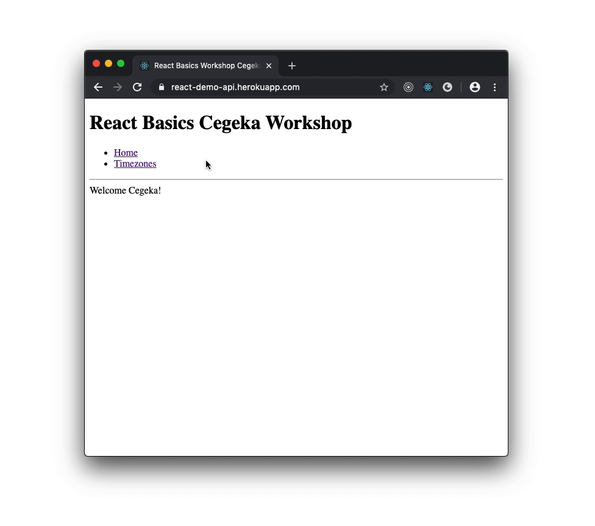
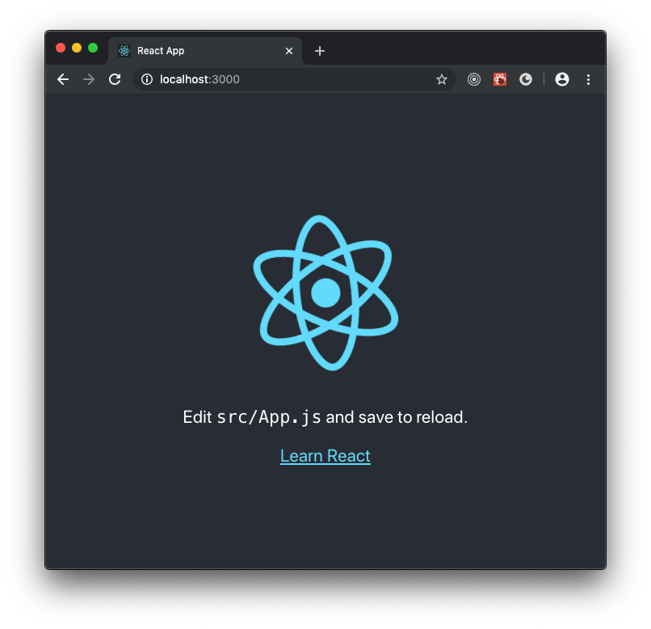

import { SplitRight } from 'mdx-deck/layouts';
import { syntaxHighlighterPrism } from 'mdx-deck/themes';
import { Image, Notes, Appear, Box } from 'mdx-deck';
import Layout from './Layout';

export const themes = [Layout, syntaxHighlighterPrism];

# React ⚛️ 👋

---

## Wer bin ich?

Patrick Wozniak

Projekt: Nürnberger Versicherung

- AngularJS (3-4 Jahre)
- React (3 Jahre)
- Angular (6 Monate)

---

## Um was geht es heute?

- Was ist React und warum React?
- Projekt aufsetzen mit React
- React Grundlagen
- Einbindung einer REST-API
- Testing

---



https://react-demo-api.herokuapp.com/

---

## Do one thing and do it well

<Appear>

<Horizontal>
  React ist eine Javascript Bibliothek zum Entwickeln von Benutzeroberflächen
  (UI)
</Horizontal>

</Appear>

<Notes>MVC (Weiter)</Notes>

---

import Counter from './Counter';

### Simply react

```jsx
import React from 'react';

function Counter(props) {
  const [count, setCount] = React.useState(props.initialCount);

  function increment() {
    setCount(count + 1);
  }

  return <button onClick={increment}>Counter: {count}</button>;
}
```

<Appear>

<Horizontal>
  <Counter initialCount={0} />
</Horizontal>

</Appear>

<Notes>
  Deklarative Komponenten = Functions, JSX, Steile Lernkurve, Pures Javascript,
  Leichte Integration in bestehende Anwendungen (Weiter)
</Notes>

---

learn once, write anywhere.

<Appear>

- react-native

- react-native-windows

- react-native-macos

- usw.

</Appear>

<Notes>Netflix</Notes>

---

# Projekt aufsetzen

```bash
npx create-react-app cegeka-app
```

Öffnet den Ordner `cegeka-app` in **Visual Studio Code**

---

# Anwendung starten

```bash
cd cegeka-app/
npm run start
```

---

```
http://localhost:3000/
```



---

Öffnet die Datei

```
src/index.js
```

<Notes>
  (VSCode) Datei zeigen. Löschen: "App.css", "App.js", "App.test.js",
  "index.css", "logo.svg", "serviceWorker.js" + import von App in index.js
  entfernen, Fehler zeigen im Browser (Weiter)
</Notes>

---

#### Aufgabe 👾

```
src/index.js
```

- Erstellt eine Funktion namens `App`
- Die Funktion soll einen String zurückgeben
  <br/><sup>Den Inhalt vom String könnt ihr bestimmen 🤭</sup>

Was seht ihr in eurem Browser?

<Notes>5min</Notes>

---

#### Lösung 🔥

```javascript
function App() {
  return 'Hallo!';
}
```

<Notes>Was haben wir da gerade gemacht? (Weiter)</Notes>

---

## React Components

```jsx
function App() {
  return 'Ich bin eine React Komponente';
}
```

**Verwendung**

```jsx
<App />
```

<Notes>React Components sind einfache Javascript-Funktionen</Notes>

---

## JSX

```jsx
function App() {
  return <h1>Ich kann aber auch HTML zurückgeben!</h1>;
}
```

<Appear>
<Horizontal>

👇 😱

```jsx
function App() {
  return React.createElement('h1', {}, 'Ich kann aber auch HTML zurückgeben!');
}
```

</Horizontal>
</Appear>

<Notes>
  JSX - Kein valides Javascript (Weiter), Beispiel zeigen mit
  React.createElement, Kompilierten Code im Browser zeigen
</Notes>

---

#### Aufgabe 👾

```
src/index.js
```

- Umschließt euren vorher definierten String in der `App`-Komponente mit einem `h1` HTML-tag

```jsx
function App() {
  return ...;
}
```

<Notes>5min</Notes>

---

#### Lösung 🔥

```javascript
function App() {
  return <h1>Hallo!</h1>;
}
```

<Notes>
  "Hallo" alleine ist ziemlich unhöflich, direkter Ansprechpartner! (Weiter)
</Notes>

---

## React "Props" 🤔

```jsx
function App() {
  return <h1>Hallo Cegeka!</h1>;
}
```

<Appear>
<Horizontal>

```jsx
function App(props) {
  return <h1>Hallo {props.name}!</h1>;
}
```

</Horizontal>
<Horizontal>

**Verwendung**

```jsx
<App name="Cegeka" />
```

</Horizontal>
</Appear>

<Notes>
  Ansprechpartner dynamisch, Javascript-Funktionen Parameter, Gemeinsam in
  VSCode
</Notes>

---

#### Aufgabe 👾

```
src/index.js
```

- Erweitert die Komponente `App` um die Prop `firstName`
- Platziert `firstName` vor dem `name` im Rückgabewert

<Appear>

Die Ausgabe im Browser sollte wie folgt sein:

<div style={{ border: '1px solid #ddd' }}>
  <h1>Hallo Patrick Wozniak!</h1>
</div>

</Appear>

<Notes>5min</Notes>

---

#### Lösung 🔥

```javascript
function App(props) {
  return (
    <h1>
      Hallo {props.firstName} {props.name}!
    </h1>
  );
}
```

```jsx
<App firstName="Patrick" name="Wozniak" />
```

<Notes>
  "Hallo" alleine ist ziemlich unhöflich, direkter Ansprechpartner! (Weiter)
</Notes>

---

#### Aufgabe 👾

Spielt ein wenig mit JSX 🤓

- Erstellt ein Array und gibt diese in JSX aus.

```jsx
{
  array.map(item => <li>{item}</li>);
}
```

- Erstellt eine If-Bedingung in JSX wie z.B.:

```jsx
{
  name ? name : 'Kein Name angegeben';
}
```

---

Kurze Pause? ☕️

---

#### Aufgabe 👾

Reusable React Components

```
src/index.js
```

- Erstellt eine neue Komponente namens `Greeting`
- Kopiert dabei die Funktionalität von `App` nach `Greeting`
- Verwendet die Komponente `Greeting` in eurer `App`-Komponente

<Notes>10min</Notes>

---

#### Lösung 🔥

```jsx
function App() {
  return <Greeting firstName="Patrick" name="Wozniak" />;
}

function Greeting(props) {
  return (
    <h1>
      Hallo {props.firstName} {props.name}!
    </h1>
  );
}
```

---

## Routing


---

#### Aufgabe 👾

Routing

- Fügt zwei Links (`<a ..></a>`) zu eurer `App` hinzu
- Der erste Link 'Home' soll auf `/` navigieren
- Der zweite Link 'Timezones' soll auf `/timezones` navigieren

Zugriff auf den aktuellen Pfad:

```javascript
const pathname = window.location.pathname;
```

- Erstellt eine neue Komponente namens `Timezones`
- `Timezones` soll `<h2>Timezones</h2>` zurückgeben
- Wenn `pathname` den Wert `/timezones` hat, <br />soll `<Timezones />` angezeigt werden
- Bei dem Wert `/` soll die Komponente `<Greeting ... />` angezeigt werden

<Notes>
  10min, Zeigen: manuell nach /timezones navigieren -> leitet auf index.html
</Notes>

---

#### Lösung 🔥

```jsx
function App() {
  return (
    <div>
      <ul>
        <li>
          <a href="/">Home</a>
        </li>
        <li>
          <a href="/timezones">Timezones</a>
        </li>
      </ul>
      {pathname === '/' && <Greeting firstName="Patrick" name="Wozniak" />}
      {pathname === '/timezones' && <Timezones />}
    </div>
  );
}

// ...

function Timezones() {
  return <h2>Timezones</h2>;
}
```

---

#### Aufgabe 👾

Komponenten auslagern

- Erstellt im `src/`-Ordner die Dateien `Greeting.js` und `Timezones.js`
- Verschiebt eure erstellten Komponenten in die jeweilige Datei

<Notes>5min, export default ...;, import ... from './...';</Notes>

---

## React Event-Handling

```jsx
function App() {
  function onButtonClick() {
    console.log('Click me!');
  }

  return <button onClick={onButtonClick}>Click me!</button>;
}
```

<Notes>(vscode) src/index.js öffnen und live zeigen</Notes>

---

## React "State" & "Hooks"

```jsx
function App() {
  const [count, setCount] = React.useState(0);

  function onButtonClick() {
    setCount(count + 1);
  }

  return <button onClick={onButtonClick}>Click me! ({count})</button>;
}
```

<Notes>State = Lokale Variable innerhalb einer React-Komponente</Notes>

---

## React Hooks

- useState
- useEffect
- useContext
- useReducer
- useCallback
- useMemo
- useRef
- useImperativeHandle
- useLayoutEffect

---

import Accordion from './Accordion';

#### Aufgabe 👾

```jsx
<Accordion title="Klicke hier!">Secret</Accordion>
```

- Erstellt eine neue Datei `Accordion.js` und in dieser eine Komponente namens `Accordion`
- Verwendet diese wie oben aufgezeigt in eurer `Timezones`-Komponente ein

- Verwendet folgende Funktionalitäten in `Accordion`:
- - `<button onClick={...}>...</button>`
- - `React.useState(..)`
- - `props.children`

Der Inhalt von `Accordion` soll erst nach einem Klick angezeigt werden:

<Accordion title="Klicke hier!">Secret</Accordion>

<Notes>20min</Notes>

---

Kurze Pause? ☕️

---

## REST API

```javascript
fetch(endpoint);
```

<Notes>src/Timezones.js öffnen und zeigen</Notes>

---

## React.useEffect()

<Notes>
  Erklärung anhand der <Accordion />, document.title
</Notes>

---

#### Aufgabe 👾

- Speichert die Response von der API in einem React State

```jsx
function Timezones() {
  const [timezones, setTimezones] = React.useState([]);

  // 1. API aufrufen in einem `React.useEffect()`-Block
  // 2. Antwort von der API in `timezones` abspeichern mittels `setTimezones()`

  return ...;
}
```

---

## Testing 🐛

Setup der Test-Umgebung

```bash
npm install --save-dev @testing-library/jest-dom @testing-library/react
```

```javascript
// src/setupTests.js
import '@testing-library/jest-dom/extend-expect';
```

---

## Tests starten

```bash
npm run test
```

---

#### Aufgabe 🐛

```javascript
// src/Greeting.test.js

import React from 'react';
import { render } from '@testing-library/react';

import Greeting from './Greeting';

test('Greeting', () => {
  const { getByText } = render(...);

  expect(...).toBeInTheDocument();
});
```

https://testing-library.com/docs/dom-testing-library/api-queries

---

## The End 😎

- https://github.com/petehunt/react-howto
- https://reactjs.org/tutorial/tutorial.html
